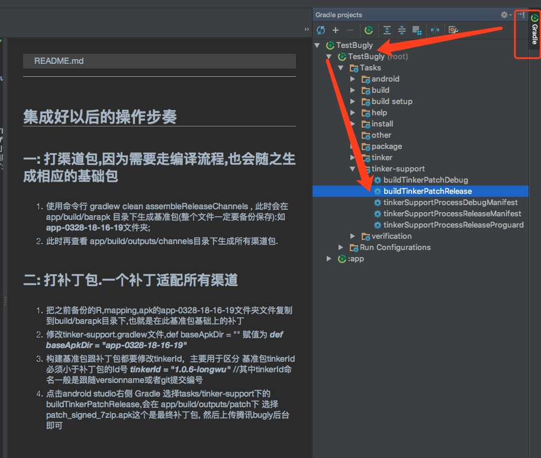

## 集成好以后的操作步奏

### 一: 打渠道包,因为需要走编译流程,也会随之生成相应的基础包

1. 使用命令行 gradlew clean assembleReleaseChannels , 此时会在app/build/barapk 目录下生成基准包(整个文件一定要备份保存):如 **app-0328-18-16-19**文件夹;
2. 此时再查看 app/build/outputs/channels目录下生成所有渠道包. 如图1 

### 二: 打补丁包.一个补丁适配所有渠道

1. 把之前备份的R,mapping,apk的app-0328-18-16-19文件夹文件复制到build/barapk目录下,也就是在此基准包基础上的补丁
2. 修改tinker-support.gradlew文件,def baseApkDir = "" 赋值为 ***def baseApkDir = "app-0328-18-16-19"***
3. 构建基准包跟补丁包都要修改tinkerId，主要用于区分  基准包tinkerId必须小于补丁包的Id号
        ***tinkerId = "1.0.6-longwu"***  //其中tinkerId命名一般是跟随versionname或者git提交编号; 如图2:
4. 点击android studio右侧 Gradle 选择tasks/tinker-support下的buildTinkerPatchRelease,会在 app/build/outputs/patch下 选择patch_signed_7zip.apk这个是最终补丁包,
然后上传腾讯bugly后台即可,如图3 

